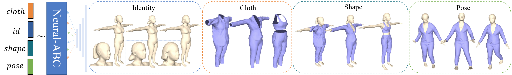
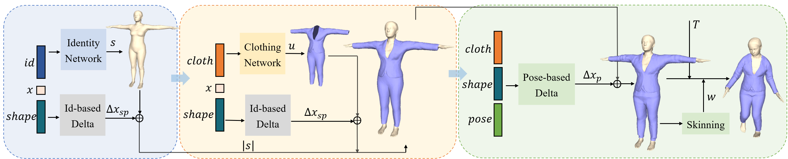

# Neural-ABC: Neural Parametric Models for Articulated Body with Clothes

PyTorch implementation of the paper "Neural-ABC: Neural Parametric Models for Articulated Body with Clothes". This repository contains the training and inference code, data.

**|[Project Page](https://ustc3dv.github.io/NeuralABC/)|**

We proposed Neural-ABC, a novel parametric model based on neural implicit functions that can represent clothed human bodies with disentangled latent spaces for identity, clothing, shape, and pose. 

## Pipeline
Neural-ABC is a neural implicit parametric model with latent spaces of human identity, clothing, shape and pose. 
It can generate various human identities and different clothes. 
The clothed human body can deform into different body shapes and poses. 



## Setup

This code has been tested on Tesla V100. 

Environment:
* Ubuntu 20.04
* python 3.8.17

Our default, provided install method is:
```
conda env create -f environment.yml
conda activate NeuralABC
pip install -r requirements.txt
```
If you have problems when installing [pytorch3d](https://github.com/facebookresearch/pytorch3d/blob/main/INSTALL.md), please follow their instructions.

Build and install `meshudf`:

cd meshudf
source setup.sh

If you have problems when installing [meshudf](https://github.com/cvlab-epfl/MeshUDF), please follow their instructions.

Download the female SMPL model from http://smplify.is.tue.mpg.de/ and place `basicModel_f_lbs_10_207_0_v1.0.0.pkl` in the folder of `./smpl_pytorch`.

Download the trained model from [here](https://drive.google.com/drive/folders/1DdmswbhXbmmel2h3ovbMK1l1S5V9nLLb?usp=sharing) and place it in the folder of `./checkpoints`.


## Citation

If you find our paper useful for your work please cite:

```
@article{Chen2024NeuralABC,
  title={Neural-ABC: Neural Parametric Models for Articulated Body with Clothes},
  author={Honghu Chen, Yuxin Yao, and Juyong Zhang},
  journal={IEEE Transactions on Visualization and Computer Graphics},
  year={2024}，
  publisher={IEEE}
}
```

## Contact
For more questions, please contact honghuc@mail.ustc.edu.cn

## Acknowledgement

Our data is processed with the help of [StereoPIFu](https://github.com/CrisHY1995/StereoPIFu_Code), [DrapeNet](https://github.com/liren2515/DrapeNet) and [MeshUDF](https://github.com/cvlab-epfl/MeshUDF):
```
@inproceedings{yang2021stereopifu,
  author    = {Yang Hong and Juyong Zhang and Boyi Jiang and Yudong Guo and Ligang Liu and Hujun Bao},
  title     = {StereoPIFu: Depth Aware Clothed Human Digitization via Stereo Vision},
  booktitle = {{IEEE/CVF} Conference on Computer Vision and Pattern Recognition (CVPR)},
  year      = {2021}
}

@inproceedings{de2023drapenet,
  author = {De Luigi, Luca and Li, Ren and Guillard, Benoit and Salzmann, Mathieu and Fua, Pascal},
  title = {{DrapeNet: Garment Generation and Self-Supervised Draping}},
  booktitle = {Proceedings of the IEEE/CVF Conference on Computer Vision and Pattern Recognition},
  year = {2023}
}


@inproceedings{guillard2022udf,
  author = {Guillard, Benoit and Stella, Federico and Fua, Pascal},
  title = {MeshUDF: Fast and Differentiable Meshing of Unsigned Distance Field Networks},
  booktitle = {European Conference on Computer Vision},
  year = {2022}
}
```
